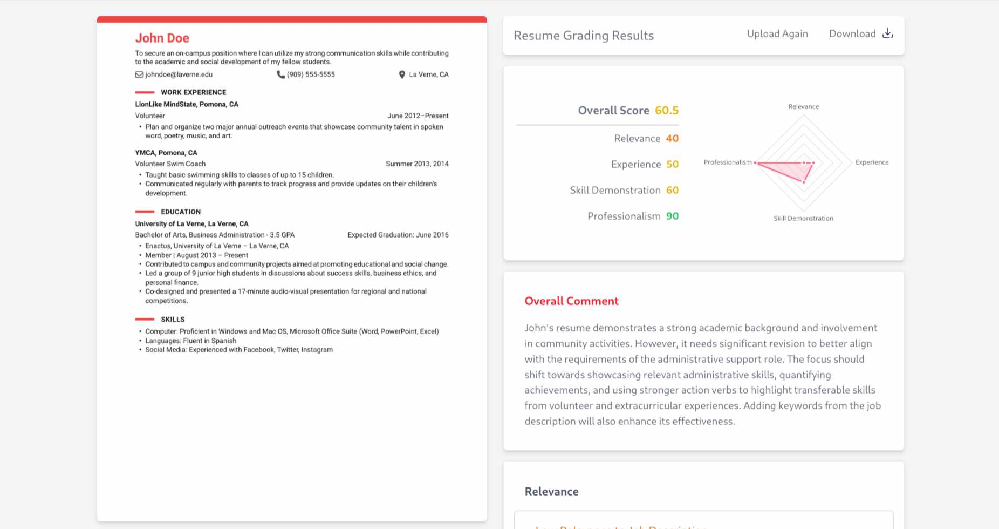

# ResumeRadar

An AI-powered resume grading tool.



## Try it

How to setup the environment and run the application.

```bash
# clone the repository
git clone https://github.com/blumenlied/ResumeRadar
cd ResumeRadar
```

- Create a Python Virtual Environment and install Python dependencies.
```bash
python -m venv env
pip install -r requirements.txt
```

- Obtain a Gemini API key and securely store it in a .env file for configuration management.
```bash
# .env
MY_API_KEY="key"
```

- Install front-end dependencies
```bash
cd frontend
npm install
```

## Developing

Start a development server:
- Start front-end
```bash
npm run dev

# or start the server and open the app in a new browser tab
npm run dev -- --open
```

- Start backend
```bash
uvicorn main:app --host 0.0.0.0 --port 80
```
